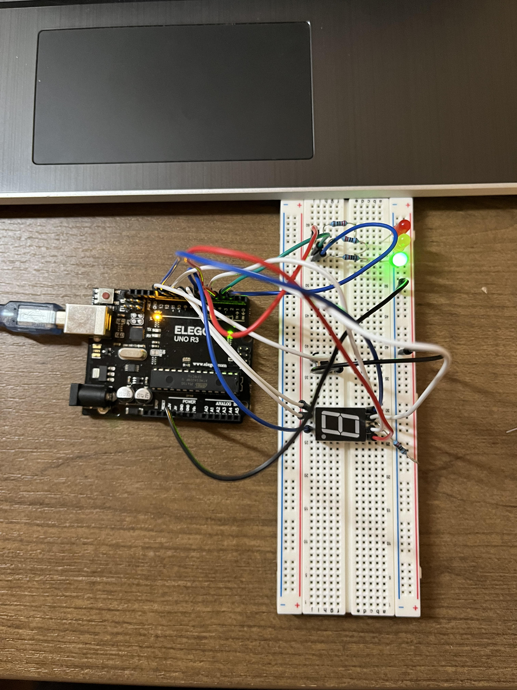
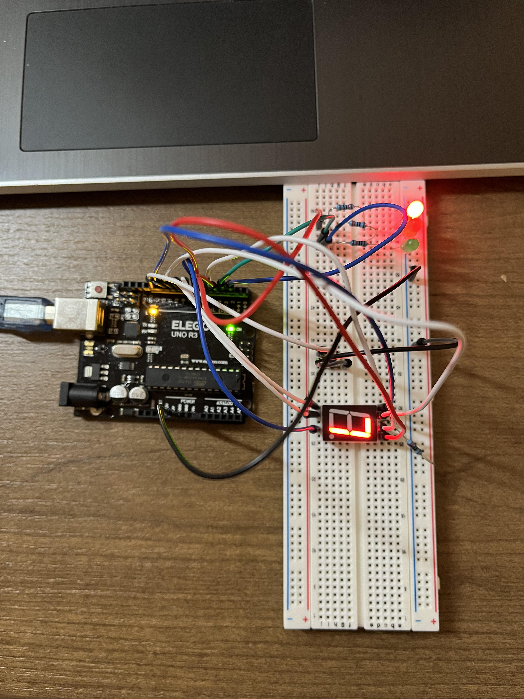
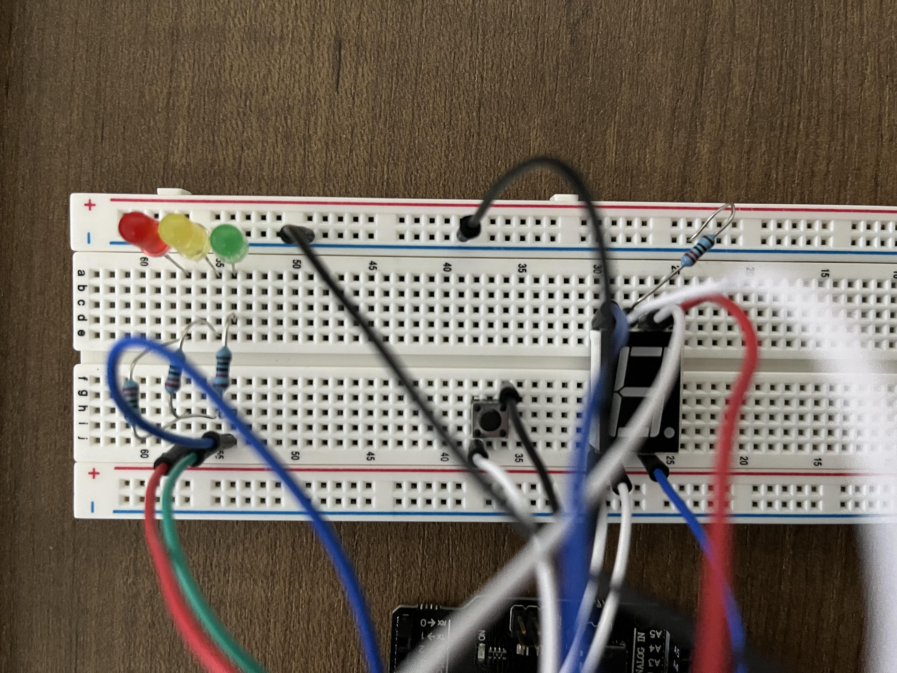

# Traffic Light Control System🚦🚸

A simple traffic light system controlled by UNO R3 Controller Board and Arduino IDE. 
### Components used:
 - UNO R3 Controller Board⚡
 - Button 
 - 1 digit 7-segment Display
 - 220 ohms resistor x 3
 - Red, Yellow, Green LED 🔴🟡🟢

### System description: ⚙️
This system simulates a traffic intersection with pedestrian crossing. Traffic light starts at red, changes to yellow then stays on green until the button is pressed. When the system detects a button pressed, the traffic light changes to red and the 1 digit 7-segment starts counting down from 9 to 0. The traffic light changes back to green light until the next button press and the system repeats. 

## Images

  

## Skills I learned
- C++
- Designing and building the system
- Programming with Arduino IDE
- Breadboarding skills
- UNO R3 Controller Board
